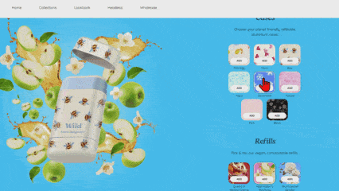

# Projects

## [React Multi-Variants Selector](https://github.com/victorw999/vite-shopify-react-hydrogen-theme-ToM2U-?tab=readme-ov-file#2-pdp-app-one-step-multi-variant-add-to-cart)
Shopify custom block created with React: Multi-variant, multi-quantity 'Add to Cart' streamlines complex product purchases for better UX.  The functionality is particularly beneficial for specialized products

### Features:
- Combining multi-variant and quantity selection into a single control
- Supporting custom bundles via metafields, unifying media display
- Using a dynamically injected entry point to add all selected items to the cart in one Shopify AJAX call

### Technology:
- React, Redux, React-router
- Pub/Sub: Sync React+vanilla JS
- Tailwindcss, Framer-motion
- Vite

### Links:
- [Video Demo](https://youtu.be/if6xtNEA810)
- [Preview Theme](https://vzine.myshopify.com/products/wild-deodorant-case?preview_theme_id=134018531428)  `Store Password: 1234`
- [Code](https://github.com/victorw999/vite-shopify-react-hydrogen-theme-ToM2U-?tab=readme-ov-file#2-pdp-app-one-step-multi-variant-add-to-cart)

### 

## [Custom React/Shopify App](https://github.com/victorw999/vite-shopify-react-hydrogen-theme-ToM2U-?tab=readme-ov-file#1-react-app-for-shopify-store)
Leveraging React, Redux, and Router to build custom app that fetch shopify store data using Admin/Storefront GraphQL APIs

### Features:
- Fetch bestsellers with Shopify Storefront APIs
- Fetch customers with Shopify Admin APIs
- Customer contact directory

### Technology:
 - React, Redux, React-router
 - Tailwindcss, Framer-motion
 - Vite, Typescript

### Links:
 - [Video Demo](https://youtu.be/-xxTLYyh8go)
 - [Preview Theme](https://vzine.myshopify.com/?preview_theme_id=134018531428)  `Store Password: 1234`
 - [Code](https://github.com/victorw999/vite-shopify-react-hydrogen-theme-ToM2U-?tab=readme-ov-file#1-react-app-for-shopify-store)

### 

## [Custom Storefronts with Headless Framework](https://github.com/victorw999/shopiy-headless-react-x6rzqeVa)
Decoupled react landing page (hosted separately) interacts with the Shopify Storefront API for data retrieval.

### Features:
- Utilizing Shopify Storefront API for order processing
- Custom-built front-end touchpoints
- Real-time products updates with Web hooks
- Secure payment processing through Shopify Payments
- Hosted on Netlify

### Technology:
 - React, React-router
 - Tailwindcss, chakra-ui,
 - Shopify-buy SDK

### Links:
 - [Video Demo](https://youtu.be/dSX9uwD-H7E)
 - [Preview Theme](https://shopiy-headless-react-x6rzqeva.netlify.app)
 - [Code](https://github.com/victorw999/shopiy-headless-react-x6rzqeVa)

### 

## [Warehouse Management System (react/firebase)](https://github.com/victorw999/warehouse_demo)
Manage & track warehouse packing/shipping tasks in order to streamline the operation for online orders.

### Features:
- Track workers task duration
- Realtime inspection by supervisor
- Realtime inventory alert
- Worker efficiency report

### Technology:
 - React, Redux
 - Materialize: Mobile-first layout
 - Firebase: User accounts & authentication
 - Firestore: NoSQL Database

### Links:
 - [Video Demo](https://youtu.be/xh8hlcQzXGM)
 - [Code](https://github.com/victorw999/warehouse_demo)

### 

